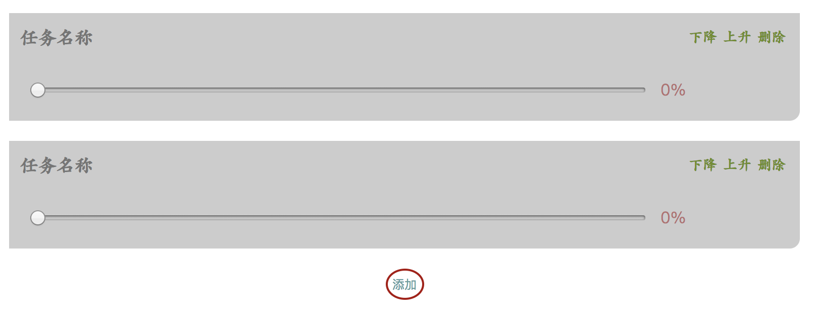

# 任务列表小应用

> 版本号: v0.0.0

## 以前实现的功能

无

## 此版本功能

1 实现页面的布局, 样式, 呈现出样子来



2 本地存储数据(indexDB)

```
无法完成, 改用vue后再做, 原生js写起来太麻烦, 双向绑定会更快
```

## 下一版本功能

1 离线浏览(PWA, sw)

## 将要实现的功能

1 搭建出服务器环境

2 能实现PC端本地app应用

3 PC端能编辑, 手机端能同步
