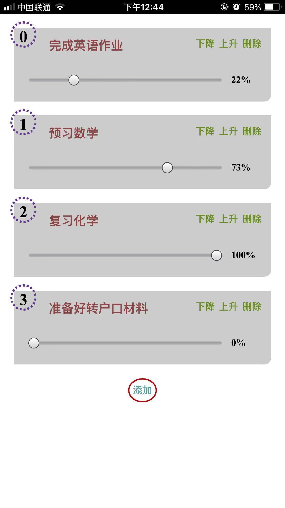

# 任务列表小应用

> 版本号: v1.0.0

## 以前实现的功能

+ [v0.0.0](https://github.com/GarvenZhang/task-list/tree/v0.0.0)

## 此版本功能

1 用vue重构, 实现基本逻辑

2 实现 ios 应用 模式

2 数据持久化(localStorage)

## 下一版本功能

1 离线浏览(PWA, sw)

## 将要实现的功能

1 搭建出服务器环境

2 能实现PC端本地app应用

3 PC端能编辑, 手机端能同步

4 用rn开发, 能解析xmind, 有链接功能, 每个人物的记录能更新到对应的xmind文件, 作为这件事上的复盘

5 实现手写版的xmind, 主要是由思维导图和导航跳转功能

6 进度条支持打tag功能

9 xmind中代码可以用特定的格式显示, 类似xmind中的备注

